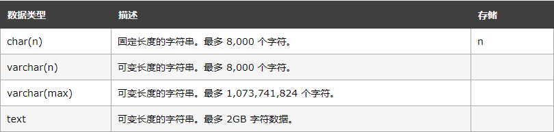

# SQL

[h3cschool](https://www.w3school.com.cn/sql "H3C")
<!-- HTML格式 -->
<font face=“微软雅黑”>
<font color=black>

## SQL Server 服务作用简介

SQL Server(MSSQLSERVER)是必须要开启的，这个是数据库引擎服务，它就像汽车的发动机一样，缺它不可。  
SQL Server代理(MSSQLSERVER)是代理服务，比如你有一些自动运行的，定时作业，或者是一些维护计划，比如定时备份数据库等操作，那么就要打开，否则，就不会备份数据库了。  
SQL Server Analysis Services (MSSQLSERVER)是分析服务，一般不用开启，除非你做多位分析，和数据挖掘，才需要开启。  
SQL Full-text Filter Daemon Launcher (MSSQLSERVER)是全文检索服务，如果你没有使用全文检索技术，那么也不需要开启。  
SQL Server VSS Writer MicrosoftSQLServer的SQL编写器服务，允许备份和还原应用程序以便在VolumeShadowCopyService(VSS)框架中进行操作。  
Sql Browser 服务 一般你要进行远程访问，不需要开启sql browser开启sql browser，通过：服务器ip,端口 这种方式就可以访问远程的服务器。  

## SQL DML 和 DDL

可以把 SQL 分为两个部分：数据操作语言 (DML) 和 数据定义语言 (DDL)。  
SQL (结构化查询语言)是用于执行查询的语法。但是 SQL 语言也包含用于更新、插入和删除记录的语法。  

查询和更新指令构成了 SQL 的 DML 部分：

* SELECT - 从数据库表中获取数据  
* UPDATE - 更新数据库表中的数据  
* DELETE - 从数据库表中删除数据  
* INSERT INTO - 向数据库表中插入数据  

SQL 的数据定义语言 (DDL) 部分使我们有能力创建或删除表格。我们也可以定义索引（键），规定表之间的链接，以及施加表间的约束。  

## SQL 中最重要的 DDL 语句

* CREATE DATABASE - 创建新数据库  
* ALTER DATABASE - 修改数据库  
* CREATE TABLE - 创建新表  
* ALTER TABLE - 变更（改变）数据库表  
* DROP TABLE - 删除表  
* CREATE INDEX - 创建索引（搜索键）
* DROP INDEX - 删除索引  

## SQL SELECT 语法

```sql server
SELECT 列名称 FROM 表名称
-- 或者
SELECT * FROM 表名称
-- SQL 语句对大小写不敏感。SELECT 等效于 select。

-- 关键词 DISTINCT 用于返回唯一不同的值。
-- 语法：
SELECT DISTINCT 列名称 FROM 表名称

-- WHERE 子句
-- 如需有条件地从表中选取数据，可将 WHERE 子句添加到 SELECT 语句。
-- 语法
SELECT 列名称 FROM 表名称 WHERE 列 运算符 值
```

下面的运算符可在 WHERE 子句中使用：

| 操作符  |     描述     |
| :-----: | :----------: |
|    =    |     等于     |
|   <>    |    不等于    |
|    >    |     大于     |
|    <    |     小于     |
|   >=    |   大于等于   |
|   <=    |   小于等于   |
| BETWEEN | 在某个范围内 |
|  LIKE   | 搜索某种模式 |
*注释：在某些版本的 SQL 中，操作符 <> 可以写为 !=。*
SQL 使用单引号来环绕文本值（大部分数据库系统也接受双引号）。如果是数值，请不要使用引号。

```sql  
-- 结合 AND 和 OR 运算符
-- 我们也可以把 AND 和 OR 结合起来（使用圆括号来组成复杂的表达式）:
-- 
SELECT * FROM Persons WHERE (FirstName='Thomas' OR FirstName='William')
-- AND LastName='Carter'
-- 
ORDER BY 语句
-- ORDER BY 语句用于根据指定的列对结果集进行排序。
-- ORDER BY 语句默认按照升序对记录进行排序。
-- 如果您希望按照降序对记录进行排序，可以使用 DESC 关键字。
-- 使用 DESC 后升序需添加 ASC 关键字
-- 
-- 以字母顺序显示公司名称：
SELECT Company, OrderNumber FROM Orders ORDER BY Company
-- 
-- 
INSERT INTO 语句
-- INSERT INTO 语句用于向表格中插入新的行。
-- 语法
INSERT INTO 表名称 VALUES (值1, 值2,....)

-- 我们也可以指定所要插入数据的列：
INSERT INTO table_name (列1, 列2,...) VALUES (值1, 值2,....)

Update 语句
-- Update 语句用于修改表中的数据。
-- 语法：
UPDATE 表名称 SET 列名称 = 新值 WHERE 列名称 = 某值

-- 更新某一行中的若干列
-- 我们会修改地址（address），并添加城市名称（city）：

UPDATE Person SET Address = 'Zhongshan 23', City = 'Nanjing'
WHERE LastName = 'Wilson'

-- DELETE 语句
-- DELETE 语句用于删除表中的行。

-- 语法
DELETE FROM 表名称 WHERE 列名称 = 值

-- 删除所有行
-- 可以在不删除表的情况下删除所有的行。这意味着表的结构、属性和索引都是完整的：
-- 
DELETE FROM table_name
-- 或者：
-- 
DELETE * FROM table_name


-- 我们可以使用下面的 SELECT 语句：
-- 
SELECT * FROM Persons
WHERE City LIKE 'N%'
-- 提示："%" 可用于定义通配符（模式中缺少的字母）。
-- 
-- 通过使用 NOT 关键字，我们可以从 "Persons" 表中选取居住在不包含 "lon" 的城市里的人：

我们可以使用下面的 SELECT 语句：

SELECT * FROM Persons
WHERE City NOT LIKE '%lon%'
```

## SQL 通配符

在搜索数据库中的数据时，SQL 通配符可以替代一个或多个字符。

SQL 通配符必须与 LIKE 运算符一起使用。

在 SQL 中，可使用以下通配符：

| 通配符                     | 描述                   |
| :------------------------- | :--------------------- |
| %                          | 代表零个或多个字符     |
| _                          | 仅替代一个字符         |
| [charlist]                 | 字符列中的任何单一字符 |
| [^charlist]或者[!charlist] | 不在字符列中的任何单一 |

## SQL IN 语法

```SQL
SELECT column_name(s)
FROM table_name
WHERE column_name IN (value1,value2,...)
```

## BETWEEN 操作符

操作符 BETWEEN ... AND 会选取介于两个值之间的数据范围。这些值可以是数值、文本或者日期。

SQL BETWEEN 语法

```SQL
SELECT column_name(s)
FROM table_name
WHERE column_name
BETWEEN value1 AND value2
```

```SQL
-- SQL Alias
-- 表的 SQL Alias 语法
SELECT column_name(s)
FROM table_name
AS alias_name
-- 列的 SQL Alias 语法
SELECT column_name AS alias_name
FROM table_name

SELECT column_name(s)
FROM table_name1
INNER JOIN table_name2 
ON table_name1.column_name=table_name2.column_name
```

## SQL LEFT JOIN 关键字

LEFT JOIN 关键字会从左表 (table_name1) 那里返回所有的行，即使在右表 (table_name2) 中没有匹配的行。

LEFT JOIN 关键字语法

```sql
SELECT column_name(s)
FROM table_name1
LEFT JOIN table_name2 
ON table_name1.column_name=table_name2.column_name
```

## SQL RIGHT JOIN 关键字

RIGHT JOIN 关键字会右表 (table_name2) 那里返回所有的行，即使在左表 (table_name1) 中没有匹配的行。

## SQL FULL JOIN 关键字

只要其中某个表存在匹配，FULL JOIN 关键字就会返回行。

## SQL UNION 操作符

UNION 操作符用于合并两个或多个 SELECT 语句的结果集。

请注意，UNION 内部的 SELECT 语句必须拥有相同数量的列。列也必须拥有相似的数据类型。同时，每条 SELECT 语句中的列的顺序必须相同。

## SQL UNION 语法

SELECT column_name(s) FROM table_name1
UNION
SELECT column_name(s) FROM table_name2
注释：默认地，UNION 操作符选取不同的值。如果允许重复的值，请使用 UNION ALL。

## SQL SELECT INTO 语句可用于创建表的备份复件

SELECT *
INTO Persons_backup
FROM Persons

* GETDATE() 返回当前日期和时间
* DATEPART() 返回日期/时间的单独部分
* DATEADD() 在日期中添加或减去指定的时间间隔
* DATEDIFF() 返回两个日期之间的时间
* CONVERT() 用不同的格式显示日期/时间

## SQL Server 数据类型

* Character 字符串：
  

test